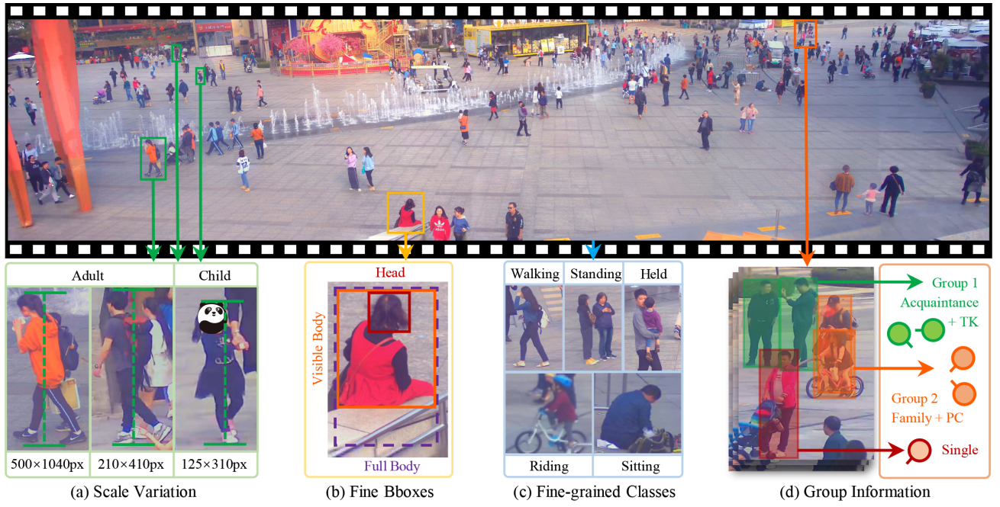
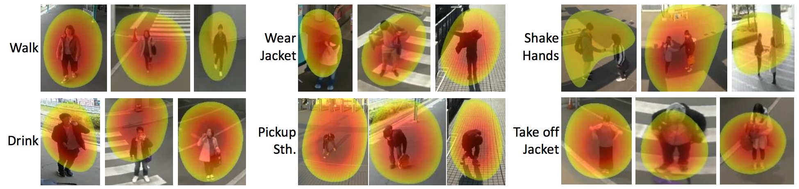

# awesome-instance-level-action-recognition

## Why awesome instance-levelaction action recognition?

This is a collection of papers and resources for instance-levelaction action recognition

## Table of Contents
- [Datasets](#datasets)
- [Papers](#papers)

## Datasets

AVA Actions Dataset [monocular-view movies, 80 action labels, labeling every 30 FPS]

 

  

 
[link](http://research.google.com/ava/)
 

 
 

PANDA Dataset [super-resolution monocular-view movies, labeling every FPS]

 

  

 
[link](http://www.panda-dataset.com/index.html)
 

 
 

360-Degree Actions Dataset [360-degrees surveillance videos, 19 action labels]

 

  

 
[link](https://github.com/ryukenzen/360action)
 

## Papers
### Dataset Papers

AVA: A Video Dataset of Spatio-temporally Localized Atomic Visual Actions (CVPR2018)

 
 [pdf](https://arxiv.org/pdf/1705.08421.pdf)
 
@inproceedings{gu2018ava,
  title={Ava: A video dataset of spatio-temporally localized atomic visual actions},
  author={Gu, Chunhui and Sun, Chen and Ross, David A and Vondrick, Carl and Pantofaru, Caroline and Li, Yeqing and Vijayanarasimhan, Sudheendra and Toderici, George and Ricco, Susanna and Sukthankar, Rahul and others},
  booktitle={Proceedings of the IEEE Conference on Computer Vision and Pattern Recognition},
  pages={6047--6056},
  year={2018}
}

Weakly-Supervised Multi-Person Action Recognition in 360◦ Videos (WACV2020)

 
 [pdf](https://openaccess.thecvf.com/content_WACV_2020/papers/Li_Weakly-Supervised_Multi-Person_Action_Recognition_in_360circ_Videos_WACV_2020_paper.pdf)
 [code](https://github.com/ryukenzen/360action)
 
 @inproceedings{li2020weakly,
  title={Weakly-Supervised Multi-Person Action Recognition in 360° Videos},
  author={Li, Junnan and Liu, Jianquan and Wang, Yongkang and Nishimura, Shoji and Kankanhalli, Mohan S},
  booktitle={2020 IEEE Winter Conference on Applications of Computer Vision (WACV)},
  pages={497--505},
  year={2020},
  organization={IEEE}
}

## Technique Papers

* [A Better Baseline for AVA](https://arxiv.org/pdf/1807.10066.pdf) - R. Girdhar et al., ActivityNet Workshop, CVPR2018. 
* [Action Tubelet Detector for Spatio-Temporal Action Localization](https://arxiv.org/abs/1705.01861) - V. Kalogeiton et al, ICCV2017. [[code]](https://github.com/vkalogeiton/caffe/tree/act-detector) [[project web]](http://thoth.inrialpes.fr/src/ACTdetector/)
* [Tube Convolutional Neural Network (T-CNN) for Action Detection in Videos](https://arxiv.org/pdf/1703.10664.pdf) - [R. Hou](http://www.cs.ucf.edu/~rhou/) et al, ICCV2017. [[project web]](http://crcv.ucf.edu/projects/TCNN/)
* [Chained Multi-stream Networks Exploiting Pose, Motion, and Appearance for Action Classification and Detection](https://arxiv.org/abs/1704.00616) - M. Zolfaghari et al, ICCV2017. [[project web]](https://lmb.informatik.uni-freiburg.de/projects/action_chain/)
* [TORNADO: A Spatio-Temporal Convolutional Regression Network for Video Action Proposal](http://openaccess.thecvf.com/content_ICCV_2017/papers/Zhu_TORNADO_A_Spatio-Temporal_ICCV_2017_paper.pdf) - H. Zhu et al., ICCV2017. 
